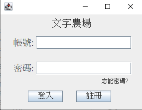
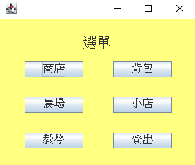
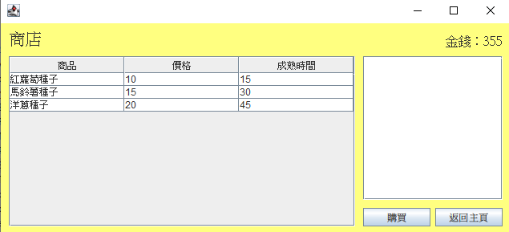
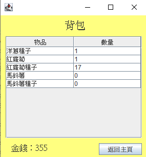
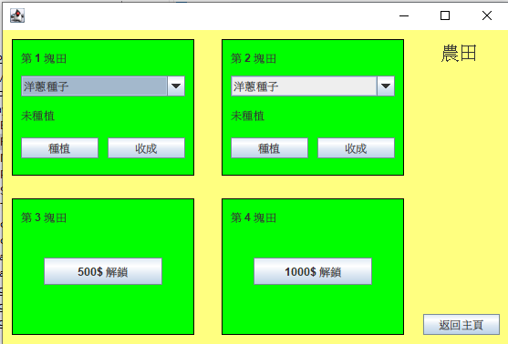
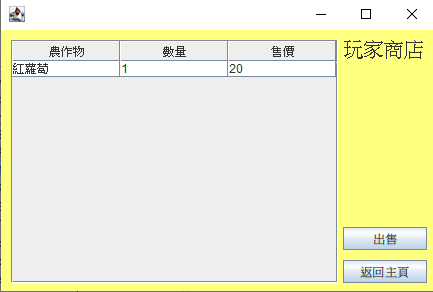

# 🌱 Java Farm Game (MVC)

一款使用 **Java Swing** 搭配 **MySQL** 開發的模擬農場經營遊戲。

本專案採用 **MVC (Model-View-Controller)** 架構設計，玩家可以購買種子、種植作物、收成、出售農作物獲得金錢，再利用金錢持續擴建自己的農場，形成完整的遊戲循環。

---

# 📖 專案介紹

本專案為 Java MVC 架構實作練習作品。

透過 **Java Swing** 建立圖形化介面，並使用 **MySQL** 儲存玩家資料、背包、農地與商店資訊。

遊戲採用 **DAO + Service** 分層設計，將畫面、商業邏輯與資料存取分離，使程式更容易維護與擴充。

玩家可以：

- 建立帳號並登入遊戲
- 前往商店購買種子
- 將種子種植於農地
- 等待作物成熟
- 收成農作物
- 前往玩家商店出售農作物
- 獲得金錢後持續經營自己的農場

---

# ✨ 功能特色

- 👤 玩家登入 / 註冊
- 🛒 商店購買種子
- 🎒 玩家背包管理
- 🌱 四塊農地種植系統
- 🔓 農地解鎖功能
- ⏱️ 作物成熟倒數計時
- 🌾 作物收成
- 🏪 玩家商店出售農作物
- 💰 金錢循環系統
- 💾 玩家資料儲存

---

# 🎮 遊戲流程

```text
登入
 │
 ▼
主畫面
 │
 ├──────────────┐
 │              │
 ▼              ▼
商店          背包
 │
 ▼
購買種子
 │
 ▼
農場
 │
 ├── 種植
 ├── 成熟倒數
 └── 收成
 │
 ▼
玩家商店
 │
 ▼
出售農作物
 │
 ▼
獲得金錢
 │
 └──────────► 回到商店購買種子
```

---

# 🖼️ 系統畫面

## 🔑 登入畫面



---

## 🏠 主畫面



---

## 🛒 商店



---

## 🎒 背包



---

## 🌱 農場



---

## 🏪 玩家商店



# 🛠️ 使用技術

- Java
- Java Swing
- Maven
- JDBC
- MySQL
- MVC Architecture
- DAO Pattern
- Service Layer
- Serializable
- Swing Timer

---

# 📂 專案架構

```text
src
│
├── controller
│   ├── Login
│   ├── Register
│   └── playInterface
│       ├── MainUI
│       ├── ShopUI
│       ├── BagUI
│       ├── FarmUI
│       └── PlayerShopUI
│
├── dao
│
├── entity
│
├── service
│
└── util
```

---

# 🗄️ 資料庫設計

本專案使用 **MySQL** 儲存遊戲資料。

| 資料表 | 用途 |
|---------|------|
| Player | 玩家資料 |
| Shop | 商店商品資訊 |
| Bag | 玩家背包 |
| Farm | 玩家農地資訊 |

---

# 🏗️ MVC 架構

```text
            UI (Swing)
                 │
                 ▼
           Controller
                 │
                 ▼
             Service
                 │
                 ▼
                DAO
                 │
                 ▼
              MySQL
```

---

# 🚀 執行方式

## 1. 匯入資料庫

匯入專案提供的 SQL：

```
farm_game.sql
```

---

## 2. 修改資料庫連線

修改：

```
DbConnection.java
```

設定自己的

- Database
- Username
- Password

---

## 3. Maven 打包

```bash
mvn clean package
```

---

## 4. 執行

```bash
java -jar farm-0.0.1-SNAPSHOT.jar
```

---

# 📚 開發心得

這是我第一次使用 **Java Swing** 搭配 **MySQL** 完成的完整 MVC 專案。

在開發過程中，不僅學習了 Java GUI 開發，也實際運用了 JDBC、DAO、Service、MVC 分層設計以及 Timer 等技術，完成了具有完整遊戲流程的農場經營系統。

透過不斷除錯與功能調整，我對 Java 專案開發流程與物件導向設計有了更深入的理解，也累積了實作大型專案的經驗。

---

# 👨‍💻 Author

GitHub：

**https://github.com/a1313855-bit**
